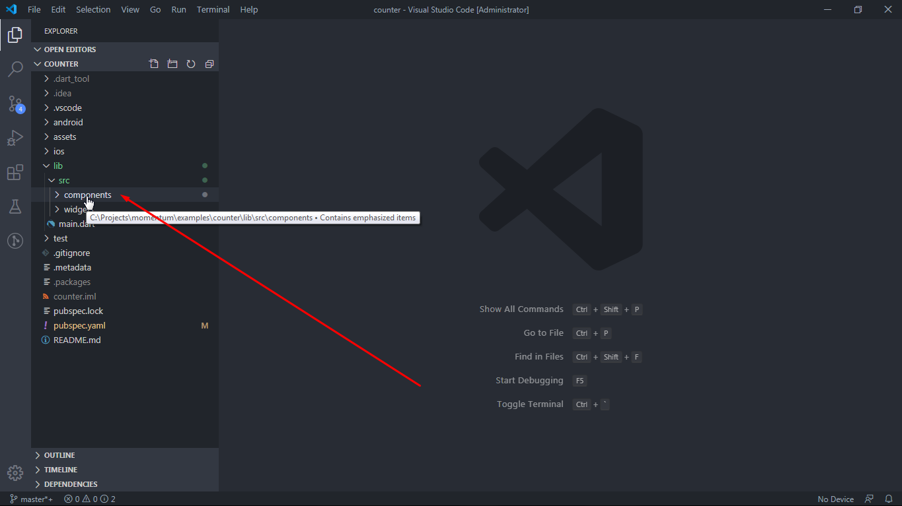
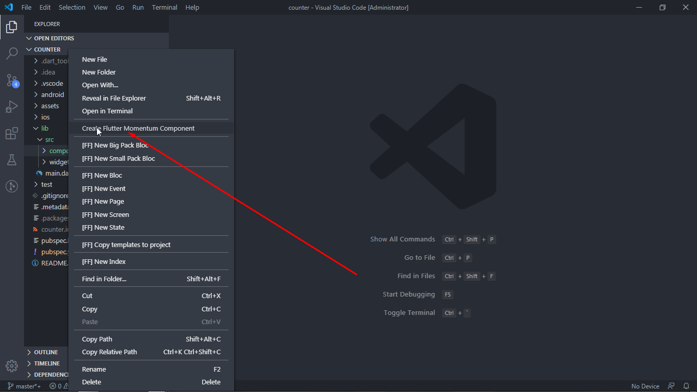
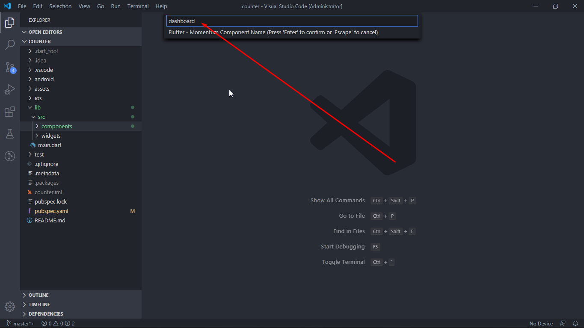
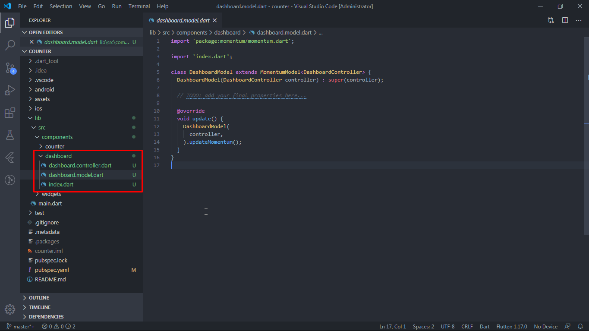

# Momentum Code Generator

Boilerplate code generator for momentum controller and model class.

## **How to Use**

1. Right click into a folder:

    

2. Select `Create Flutter Momentum Component`:

    

3. Enter component name:

    

4. Generated files look like this:

    

*Happy Coding!*